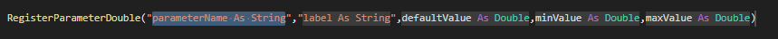
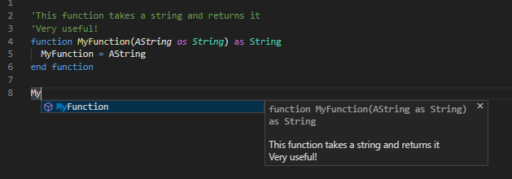
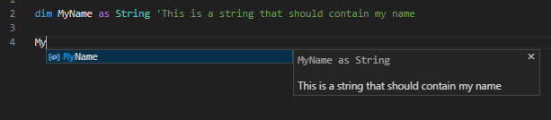

### 0.4.0
- **New**: Added support for Viz5
  - Scene scripts: `.vs5 .viz5`
  - Container scripts: `.vs5c .viz5c`

### 0.3.3
- **Fix**: Fixed bug on SignatureHelp
### 0.3.2
- **Fix**: Security patch

### 0.3.1
- **Fix**: Updated SignatureHelp and Completions to support more cases

### 0.3.0
- **New**: Added support for Viz4
  - Scene scripts: `.vs4 .viz4`
  - Container scripts: `.vs4c .viz4c`

---

### 0.2.25
- **Change**: Updated SignatureHelp to support more complex parameters without failing

---

### 0.2.24
- **Fix**: Fixed bug were SignatureHelp would fail when using doubles as parameters

---

### 0.2.23
- **Fix**: Fixed bug with missing feedback when setting scripts in Viz

---

### 0.2.22
- **Fix**: Rewrote SignatureHelp for more accurate and consistent results
- **Fix**: Improved completion detection to support more intricate syntax
- **Change**: Updated versions of all dependencies 
- **Change**: Utilized the new status bar background color to move syntax check error messages to status bar
- **New**: Added `"statusBarItem.errorBackground"` to color themes
- **New**: Added keywords to completions
- **New**: Option `vizscript.keywordLowercase` - Makes all keywords(if,else etc.) lowercase

---

### 0.2.21
- **Fix**: Fixed bug were nested arrays as return values for functions would lead to "Catastrophic Backtracking" in regex
- **Fix**: Fixed bug were arrays as return values for functions would destroy Signature Help
- **Fix**: Added special case for "Println" and "Random" to avoid adding "()" at end of completion

---

### 0.2.20
- **Fix**: Fixed bug were error message from Viz would not always parse correctly

---

### 0.2.19
- **Fix**: Fixed a bug were SignatureHelp would spam the console if a function was not found.
- **Fix**: Fixed a bug were "Get scripts from Viz" would fail with undefined VizId when using the new file option

---

### 0.2.18
- **New**: Added option to show Event completion snippets on root level. (e.g. OnInit())
- **New**: Option `vizscript.showEventSnippetCompletionsOnRoot` - Show Event completions on root

---

### 0.2.17
- **Fix**: Fixed bug were switching between tabs would not update extension data correctly
- **Fix**: Improved Definition results further and changed selection range to follow VS Code standard
- **Fix**: Added correct return types for document functions to support Code Completion and Definitions

---

### 0.2.16
- **Fix**: Fixed bug were types inside Arrays sometimes gave wrong Definition results
- **Fix**: Fixed bug were parameters had wrong ranges in Definition results

---

### 0.2.15
- **Fix**: Updated Definition provider to return better hover previews

---

### 0.2.14
- **Fix**: Rewrote Definition provider to support more intricate types. Now supports Arrays, Structs and nesting
- **Fix**: Fixed issue were sometimes the extension was unable to provide feedback when compiling or setting script in Viz
- **Change**: "Get scripts from Viz" is now available at all time and will trigger activation of the extension

---

### 0.2.13
- **Change**: Changed "Get scripts from Viz" to handle each container individually
- **Change**: Added "Compile OK" as Status Bar Message for successful compiles
- **New**: Added completions for Container/Scene to root level. (Can be disabled in settings)
- **New**: Option `vizscript.showThisCompletionsOnRoot` - Show completions for Container/Scene on root

---

### 0.2.12
- **Fix**: Fixed bug were "exit function" or "exit sub" would sometimes be replaced by a completion
- **Fix**: Added custom folding for sub, function and structure to avoid incorrect folding
- **New**: Added "True" and "False" to completions for convenience

---

### 0.2.11
- **Fix**: Fixed bug were "else" keyword would sometimes be replaced by a completion

---

### 0.2.10
- **Fix**: Fixed bug were Viz would sometimes crash when applying a script from the editor
- **Change**: Rewrote the container script logic to gather all similar scripts and set them all at the same time

---

### 0.2.9
- **Fix**: Fixed bug were "then" keyword at the end of if sentence would sometimes be replaced by a completion
- **Change**: Renamed command "Compile code" to "Syntax check"
- **New**: Added initial support for getting scripts from Viz and linking it to a container or the scene script. (Command: Get scripts from Viz)

---

### 0.2.8
- **Fix**: Fixed bug were variables inside built-in events were available in all scopes
- **Fix**: Fixed bug were built-in events were allowed multiple times
- **New**: Added initial support for "live coding" by setting the scene script in the currently open scene directly while OffAir (<kbd>ctrl</kbd>-<kbd>shift</kbd>-<kbd>F5</kbd>)
- **Change**: Removed "OnAir check" for (<kbd>ctrl</kbd>-<kbd>F5</kbd>) to be able to validate code without being OnAir
- **Change**: Option `vizscript.compiler.hostPort` - Default port changed to 6998 to be able to work OffAir

---

### 0.2.7
- **Fix**: Fixed another bug that could sometimes result in the extension crashing

---

### 0.2.6
- **Fix**: Fixed bug were reopening VS Code would sometimes result in the extension crashing

---

### 0.2.5
- **Fix**: Resolved small issue with snippet completions. Global Procedures without parameters or with overloads will no longer use snippet completions

---

### 0.2.4
- **New**: Initial support for snippet completions on Global Procedures. This feature will autofill placeholder values in the parameters and <kbd>tab</kbd> will jump to the next parameter.(disabled by default)
- **New**: Option `vizscript.enableGlobalProcedureSnippets` - Enable snippet completions for Global Procedures

---

### 0.2.3
- **New**: Support for both Scene and Container scripts
- **New**: The extension now contributes two languages `VizSceneScript` and `VizContainerScript`
- **New**: "This" keyword enables context sensitive completions based on the language selected
- **New**: Script type will automatically be selected when a file is opened based on the file extension
  - Scene scripts: `.vs .viz .v3script `
  - Container scripts: `.vsc .vizc`

---

### 0.2.2
- **New**: Added documentation support for document completions. Functions, subs and variables supported for now.
	- A comment directly above a function or sub will be used as description.

		
  - A comment directly after a variable declaration will be used as description.

    

---

### 0.2.1
- **Fix**: Rewrote line logic to support nested brackets and parantheses
- **Change**: Improved support for Arrays

---

### 0.2.0
- **Change**: Updated readme and documentation to reflect the new changes
-
---

### 0.1.14
- **Fix**: Improved compile feature to work without interupting the Viz renderer. Now creates a dummy scene and uses it to compile the code and give feedback.

### 0.1.13
- **New**: Added feature to compile code on Viz Engine and get feedback in Vs Code.
- **New**: Option `vizscript.enableAutoCompleteHost` - Enable Auto Complete functionality
- **New**: Option `vizscript.enableSignatureHelp` - Enable Signature Help for both built-in and custom procedures
- **New**: Option `vizscript.enableDefinition` - Enable Jump to Definition for easy navigation
- **New**: Option `vizscript.compiler.hostName` - The hostname for connection to Viz Engine
- **New**: Option `vizscript.compiler.hostPort` - The port number for connection to Viz Engine

---

### 0.1.12
- **Fix**: Fixed bug were Function and Sub parameters would show up in wrong scopes while writing new functions.

### 0.1.11

- **Fix**: Further improvements on completions. Fixed bug with overloading for document symbols. Now has full overload support for all procedures.
- **Fix**: Added extra check to remove leading "(" on completion strings

### 0.1.10
- **Change**: Major improvements on Completion suggestions. Now supports nesting, parantheses and brackets.
- **Change**: Small adjustments to Syntax Highlighting to highlight important types in all contexts.

### 0.1.9
- **Fix**: Fixed small bug were document scope didn't work for all completions.

### 0.1.8
- **New**: Added configuration settings to turn features on and off.

### 0.1.7
- **Change**: Added different commit characters for procedures and types. Fixed a small bug in syntax highlighting.

### 0.1.6
- **New**: Added classic Viz3 color scheme and a new custom one
- **Change**: Refined syntax highlighting to better support all types
- **Change**: Refined how Global Events are completed

### 0.1.5
- **Change**: Added configuration recommendation to readme
- **Change**: Updated SignatureHelp GIF

### 0.1.4
- **New**: Added demo gifs to Readme

### 0.1.3
- **Change**: Improved completion items suggested by the plugin in different contexts
- **Fix**: Fixed some strange syntax highlighting

### 0.1.2
- **Fix**: Fixed bug where parameters were not showing up in Auto Complete inside functions

### 0.1.1
- **Change**: Renamed configuration settings as they are not yet implemented.

### 0.1.0
- Initial beta release