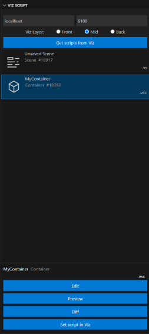

# Viz Script for Visual Studio Code

> A complete language extension for Viz Script development in Visual Studio Code

## New Features - Viz Script 0.6.0

* **Metadata System** - Enhanced script management and tracking
  * **Automatic Metadata Generation**: Scripts now automatically receive comprehensive metadata including:
    * Unique UUID for permanent script identification
    * Scene path tracking to remember which Viz scene the script belongs to
    * Local file path associations for better file management
    * Script type detection (Scene/Container scripts)
    * Viz version detection (Viz3/Viz4/Viz5) based on file extensions
    * Grouped collection support for complex script hierarchies
  * **Smart Metadata Injection**: 
    * Automatically detects scripts without metadata and offers to add it
    * Preserves existing metadata while completing missing fields
    * Configurable auto-injection without user prompts
  * **Metadata Validation & Auto-completion**:
    * Validates metadata structure and required fields
    * Auto-completes incomplete metadata with contextual information
    * Scene path validation ensures scripts stay synchronized with active Viz scenes
  * **Flexible Formatting Options**:
    * Full format: Multi-line JSON for readability
    * Compact format: 3-line condensed format
    * One-line format: Minimal space usage
  * **Configuration Options**:
    * Enable/disable metadata functionality
    * Auto-update mode for seamless workflow
    * Customize formatting preferences
    * Control file path handling (absolute vs relative paths)
  
* **Parameters panel**
  * The parameters panel will eventually show all parameters created in the script, similar to how Viz does internally
  * Currently only supports buttons, bool and int correctly

## New Features - Viz Script 0.5.0
* Initial beta support for the sidebar panel
  * Get and list scripts from Viz engine in front, mid or back layer
  * Edit, diff and set current script in Viz
  * Double click to view read-only

  

## New Features - Viz Script 0.4.0
 * Now supports Viz5
    * Activate by triggering `Change Language Mode` on Command Palette and choosing `Viz5SceneScript` / `Viz5ContainerScript` or by opening a supported filetype.
      * Scene scripts: `.vs5 .viz5`
      * Container scripts: `.vs5c .viz5c`


## New Features - Viz Script 0.3.0
 * Now supports Viz4
    * Activate by triggering `Change Language Mode` on Command Palette and choosing `Viz4SceneScript` / `Viz4ContainerScript` or by opening a supported filetype.
      * Scene scripts: `.vs4 .viz4`
      * Container scripts: `.vs4c .viz4c`


## Features
* Syntax Highlighting
* Auto-Completion ( <kbd>ctrl</kbd>-<kbd>spacebar</kbd> to trigger, auto triggers if Quick Suggestions: "Other" is true.)
  * Supports both built-in and document completions
  * Includes completions updated to Viz Engine/Artist 3.14
* Color Themes
* Syntax check your code on a Viz Engine ( <kbd>ctrl</kbd>-<kbd>f5</kbd>)
* Get and set container and scene scripts in Viz Artist ( Commands: `Get scripts from Viz`  and  `Set current script in Viz`)
* Signature Help (<kbd>ctrl</kbd>-<kbd>shift</kbd>-<kbd>spacebar</kbd> to trigger, auto triggers on `"("` if function/sub is found ) 
  * Supports both built-in and document functions. 
  * Supports overloading
* Definition Provider(<kbd>ctrl</kbd>-click to jump to definition )
* Symbol Searching (<kbd>ctrl</kbd>-<kbd>shift</kbd>-<kbd>o</kbd> to trigger )

## Activation of plugin
* Activate by triggering `Change Language Mode` on Command Palette and choosing `VizSceneScript` / `VizContainerScript` or by opening a supported filetype.
* Can also be triggered by running `Viz Script: Get scripts from Viz`

    ### Supported filetypes Scene script:
        .vs
        .viz
        .v3script (legacy, might be removed)

    ### Supported filetypes Container script:
        .vsc
        .vizc


----------

## Changes - Viz Script 0.2.22
* Added keywords to completions. (if,then,else etc.)
	* Keywords are lowercase by default. Can be changed in settings `vizscript.keywordLowercase`
* Utilized the new status bar background color to move syntax check error messages to status bar
  * VS Code version must be `1.53.0` or higher 

## New Features - Viz Script 0.2.18
* Added option to show Event completion snippets on root level. (e.g. OnInit())
	* This feature can be deactivated in settings `vizscript.showEventSnippetCompletionsOnRoot` (Activated by default)

## Changes - Viz Script 0.2.14
* Definition provider now supports more types.
* `Get scripts from Viz` is now available at all time. Also without any document open.

## New Features - Viz Script 0.2.13
* Added completions for Container and Scene on root level
  * This feature can be deactivated in settings `vizscript.showThisCompletionsOnRoot` (Activated by default)

## New Features - Viz Script 0.2.9
* Early support for communication with Viz Artist
  * The command `Get scripts from Viz` will list all scene and container script in the currently active scene
  * The command `Set current script in Viz` or shortcut <kbd>ctrl</kbd>-<kbd>shift</kbd>-<kbd>F5</kbd> will set the fetched script in Viz Artist


## New Features - Viz Script 0.2.4
* Initial support for snippet completions on Global Procedures (disabled by default)
    * To enable change following setting to true:
        * Enable Global Procedure Snippets: Enable snippet completions for Global Procedures. This will autofill placeholder values in the parameters and 'tab' will jump to the next parameter.

         

## New Features - Viz Script 0.2.3
* Now supports both Scene and Container scripts
    * The extension now contributes two languages
        * VizSceneScript
        * VizContainerScript
    * Validation works for both variants
    * "This" keyword enables context sensitive completions based on the language selected
    * The correct script type will automatically be selected when a file is opened based on the extension
        * Scene scripts:
            * .vs
            * .viz
            * .v3script (legacy, might be removed)
        * Container scripts:
            * .vsc
            * .vizc

* Added support for descriptions on document completions
    * A comment directly above a function or sub will be used as description.

    
     * A comment directly after a variable declaration will be used as description.

    

## New Features - Viz Script 0.2.0
* Validate your code on a Viz Engine
    * Shortcut <kbd>ctrl</kbd>-<kbd>F5</kbd> or `Viz Script: Compile code` on Command Palette (Ctrl-Shift-P)
    * The line with an error will be highlighted in the editor.
    * The hostname and port can be configured in the extension.
    * Viz Engine must be OnAir.
* Turn features on and off in the extension configuration.
    * Right click extension and choose "Extension Settings"
    * Settings:
        * Host Name: The hostname for connection to Viz Engine
        * Host Port: The port number for connection to Viz Engine
        * Enable Auto Complete: Enable Auto Complete functionality
        * Enable Definition: Enable Jump to Definition for easy navigation
        * Enable Signature Help: Enable Signature Help for both built-in and custom procedures
* Color Themes
    * Right click the extension and choose "Set Color Theme" or Command Palette - "Preferences: Color Theme"
    * Themes:
        * Viz Script Classic (Colors based on the original palette from Viz)
        * Viz Script Enhanced (Updated color palette for improved readability)


<br>

---

<br>

## VS Code Settings
I recommend these settings in VS Code to get the best result with this plugin.

To open settings.json:
* Ctrl-Shift-P to open Command Palette
* Search for "Preferences: Open Settings(JSON)
* Paste the code below. Remember "," between each setting.

```json
"editor.quickSuggestions": {
    "other": true,
    "comments": false,
    "strings": false
},
"editor.wordBasedSuggestions": false,
"editor.foldingHighlight": false
```


## Disclaimer
I have no affiliation with Vizrt and this extension is personal work.

<br>

---

<br>
<br>

## Demos

### Type Completion


### Structure support


### Jump to Definition


### Signature Help

