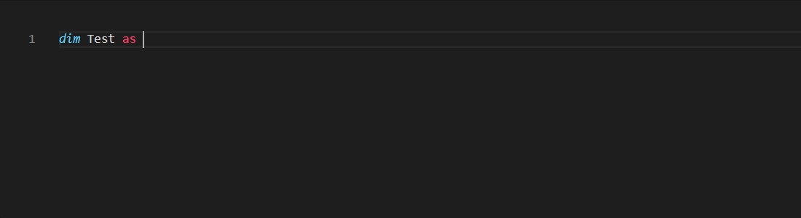
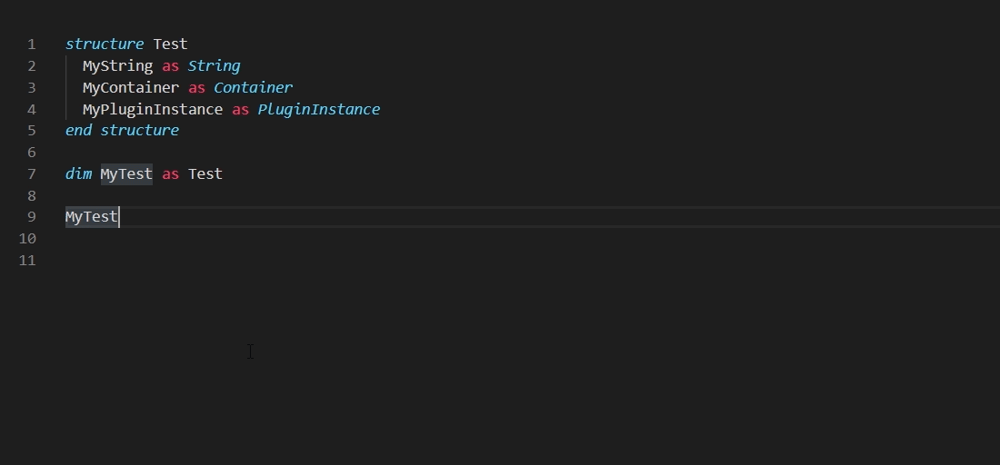
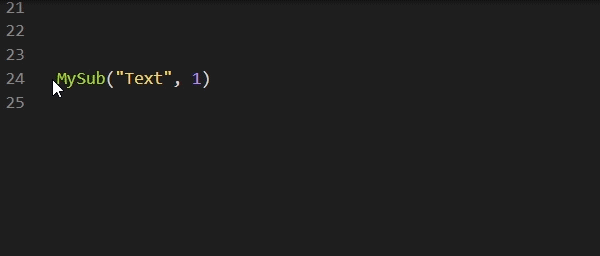
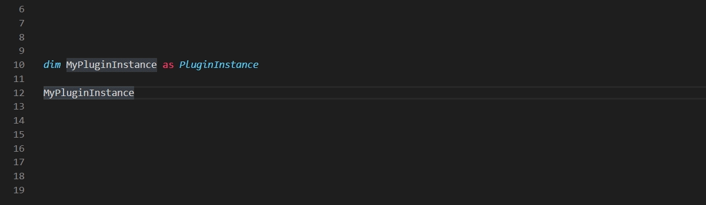

# Viz Script for Visual Studio Code

> A complete language extension for Viz Script development in Viz Artist

## New Features - Viz Script 0.2.0
* Validate your code on a Viz Engine
    * Shortcut Ctrl-F5 or `Viz Script: Compile code` on Command Palette (Ctrl-Shift-P) 
    * The line with an error will be highlighted in the editor. 
    * The hostname and port can be configured in the extension. 
    * Viz Engine must be OnAir.
* Turn features on and off in the extension configuration.
    * Right click extension and choose "Extension Settings"
    * Settings:
        * Host Name: The hostname for connection to Viz Engine
        * Host Port: The port number for connection to Viz Engine
        * Enable Auto Complete: Enable Auto Complete functionality
        * Enable Definition: Enable Jump to Definition for easy navigation
        * Enable Signature Help: Enable Signature Help for both built-in and custom procedures
* Color Themes
    * Right click the extension and choose "Set Color Theme" or Command Palette - "Preferences: Color Theme"
    * Themes:
        * Viz Script Classic (Colors based on the original palette from Viz)
        * Viz Script Enhanced (Updated color palette for improved readability)

## Features
* Syntax Highlighting
* Color Themes
* Validate your code on a Viz Engine 
* Signature Help (for both built-in and document functions. With support for overloading)
* Definition Provider(Ctrl-click to jump to definition)
* Symbol Searching (Ctrl-Shift-O to trigger)
* Auto-Completion (Ctrl-spacebar to trigger, auto triggers if Quick Suggestions: "Other" is true.)
    * Supports both built-in and document completions)<br>
	* Includes completions updated to Viz Engine/Artist 3.14

# Features

## Available commands

* `Bookmarks: Toggle` Mark/unmark positions with bookmarks


## Supported filetypes
* .vs 
* .v3script 
* .viz


## VS Code Settings
I recommend these settings in VS Code to get the best result with this plugin.

To open settings.json:
* Ctrl-Shift-P to open Command Palette
* Search for "Preferences: Open Settings(JSON)
* Paste the code below. Remember "," between each setting.

```json
"editor.quickSuggestions": {
    "other": true,
    "comments": false,
    "strings": false
},
"editor.wordBasedSuggestions": false,
"editor.foldingHighlight": false
```


## Disclaimer
I have no affiliation with Vizrt and this extension is personal work. 

<br>

---

<br>
<br>

## Demos

### Type Completion


### Structure support


### Jump to Definition


### Signature Help

